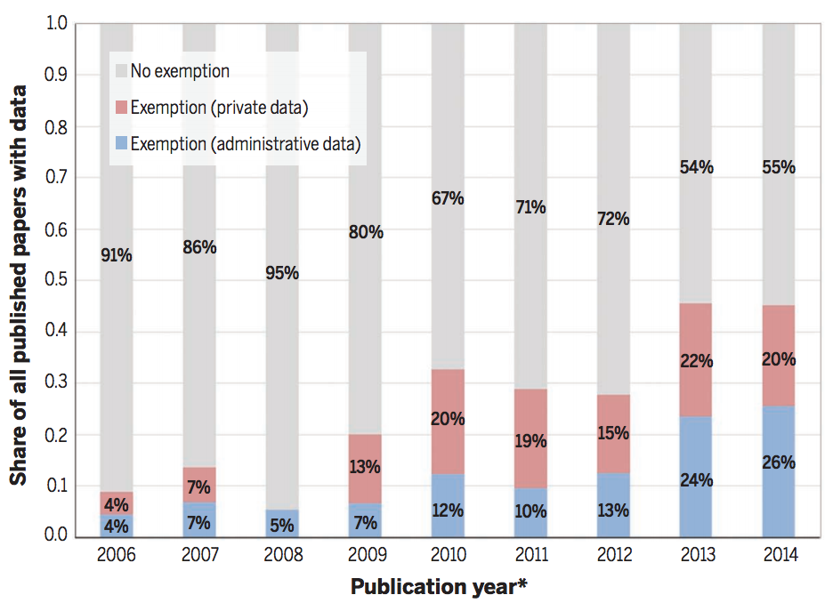

# 税情報を含む公的データの研究利用に関する取り組み
## USでの事例
多くの人がUSでの公的データの利用に関して、幅広いアクセスを要求してきた。その要求は2019年の1月14日の「エビデンスに基づいた政策立案に関する基礎」法（Foundations for Evidence-Based Policymaking Act）の法案設立を持って概ね、一つの画期を迎えたと言えるだろう。\\
ただしこの法案もEBPMに向けてのプラン策定などを義務付けることに留まっており、具体的にどのような体制でやっていくかはこれから定まってくるところである。

* [H.R.1831 - Evidence-Based Policymaking Commission Act of 2016](https://www.congress.gov/bill/114th-congress/house-bill/1831)
  * エビデンスに基づく政策立案評議会法。EBPM促進に向けた評議会を実施し提言を行うことを要求。
  * 評議会で提出された[プレゼンテーション](https://www.cep.gov/library/presentations.html)は便利かも。\\
    例えばchettyの[プレゼン](https://www.cep.gov/events/2016-07-22/chetty.pdf)などがある。
  * [Commission on Evidence-based Policymaking(CEP)](https://www.cep.gov/)
    * 米国においてEBPMの促進に向けて超党派で結成。09/2017に最終報告書が提出された。内容はデータの利活用の促進とそれに伴う個人情報保護の取り組み強化の重要性について。

* [H.R.4174 - Foundations for Evidence-Based Policymaking Act](https://www.congress.gov/bill/115th-congress/house-bill/4174)
  * 10/31/2017: Introduced in House
  * 01/14/2019: Became Public Law No: 115-435.
  * This bill requires departments and agencies identified in the Chief Financial Officers Act to submit annually to the Office of Management and Budget (OMB) and Congress a plan for identifying and addressing policy questions relevant to the programs, policies, and regulations of such departments and agencies.The plan must include: (1) a list of policy-relevant questions for developing evidence to support policymaking, and (2) a list of data for facilitating the use of evidence in policymaking.

  * 次の２つの法の基礎法となっている？\\
  (ちょっとわかっていない。上記URLにタイトルだけ記されているが、合衆国法案に関する知識を持ち合わせていないので。。。)
    * H.R.1770: OPEN Government Data Act
    * H.R.5215: Confidential Information Protection and Statistical Efficiency Act

  * 制定にあたってはCommission on Evidence-Based Policymakingからの勧告などを強く反映している([参照](https://www.govtrack.us/congress/bills/115/hr4174))

* [H.R.1770 - OPEN Government Data Act](https://www.congress.gov/bill/115th-congress/house-bill/1770)
  * 03/29/2017: Introduced in House
  * 01/14/2019: Passed in Congress

  * オープンになっている政府のデータ資産は機械可読な状態で公開することを求める（pdfによる公開とかはダメってことだろうか）
  * データはオープンライセンス

## アメリカにおける税情報利用について
Card, Chetty, Feldstein and Saez(2010)から
- 税データ：Statistics of Income Joint Statistical Research Program というプログラムで毎年研究者から課題を募って、税情報を提供して研究を行っている。[2016年に採択された研究リスト](https://www.irs.gov/pub/irs-soi/16jsrpprojects.pdf)
- 失業保険データ：幾つかの州で国勢調査局の Longitudinal Employer–Household Dynamics (LEHD) プログラムを通じて、オンサイトでの取得に限定して可能
- 社会保障庁(SSA)の所得データ：SSAへのインターンシップもしくはSSAの研究者との共著を通じて取得可能

## アメリカ以外での税情報利用について
* Almunia, M., Harju, J., Kotakorpi, K., Tukiainen, J., & Verho, J. (2018). Expanding access to administrative data: The case of tax authorities in Finland and the UK. International Tax and Public Finance, 1-16.
  * ものすごいマニアックな論文な気がするが、、、（雑誌のIFは0.967だが業界標準がわからない）
  * 税当局と研究者が協働し、良い体制を築けた例を紹介
  * the HMRC Datalab in the UK
    1. 研究プロポを提出して承認されたら然るべきトレーニングの後に税情報を提供
  * the remote access to data from Statistics Finland
    1. 2009年からフィンランドの大学や研究機関において税データの個票データのリモートアクセスシステムを実装
    2. 厳格なログイン体制、システム出力ファイルの転送不可制限、研究用の抽出ファイルの職員による個別チェックなど厳しく個人情報保護を確認している

# Admin data について
## アドミンデータの積極的利活用は非常に望ましい
* アドミンデータを用いた論文は増え続けている\\
図表を参照

  <figure class="blog-picture" style="text-align:center">
    
    <figcaption>AERの実証論文の中でアドミンデータを使用した論文の割合(Einav & Levin, 2014)</figcaption>
  </figure>

* アドミンデータを用いた利点
  * 超長期的な政策効果を検証できる(Chetty, 2012)

  * missing data biasがほとんど存在しない(Einav & Levin, 2014)
    * 統計的抽出における恣意性の問題の制約を受けない

  * サンプルサイズが非常に大きいことが多く、自然実験的な状況や擬似実験的な状況を無理なく利用できることが多い(Einav & Levin, 2014)

* アドミンデータを阻むもの
  * 個人情報保護の問題 \\
  ただしUSのthe  Centers  for  Medicare  and  Medicaid  Services(CMS)や北欧みたいに匿名化したデータの提供に成功している例は十分にある(Card, Chetty, Feldstein and Saez, 2010)。
    * Card, Chetty, Feldstein and Saez(2010)ではそれぞれの取り組みを紹介。以下はMedicare and Medicaid Servicesについての抄訳。
    > アドミンデータへの日常的なアクセスの研究へのンパクトとして際立った例がCMSである。毎年の何百という医療研究がResDAC(ミネソタ大学に置かれた研究データ支援センター)をマイクロ個票データのリクエストを発展させるために利用している。メディケア及びメディケイドデータへの日常的なアクセスは合衆国のヘルスケア研究者がそのリーダー的なポジションを世界で維持することを可能にしており、多くの公的な利点をもたらしている。

  * 「Simulated dataの提供やComputer Programの提出（日本でのオーダーメイド統計に近いかな）で良いのではないか？」という代替案の誘惑\\
  Card, Chetty, Feldstein and Saez(2010)では「これらの手法では問題解決の役には立たない」とバッサリ。

## 参考文献
（読んだ）
  * Card, D., Chetty, R., Feldstein, M. S., & Saez, E. (2010). Expanding access to administrative data for research in the United States. American Economic Association, Ten Years and Beyond: Economists Answer NSF’s Call for Long-Term Research Agendas.
    * 少し古いが合衆国のトップ研究者によるアドミン情報アクセスに関する提言
    * 単にアドミンデータのアクセス権を要求するだけでなく、どのようなアクセスがなされるべきかなど検討
    * このレポートではデータは各々の行政区分に応じた分権的なアクセスが良いだろうとしている。一方で上記CEPでは中央集権的なアクセスが良いとしており、どのような議論があったのだろうか興味深い（わからない）。

  * Einav, L., & Levin, J. (2014). Economics in the age of big data. Science, 346(6210), 1243089.
    * Scienceに掲載されたビッグデータの経済学的活用に関する論文。アドミンデータの利活用及びその利点について1節用いて強調している。

  * 津田広和・岡崎康平(2018). 米国におけるEvidence-based Policymaking（EBPM）の動向, RIETI ポリシーディスカッションペーパー(https://www.rieti.go.jp/jp/publications/summary/18110004.html)
    * アメリカが「EBPM のトップランナーである米国の取り組み」と言っているが、当のU.S.の研究者はCard, Chetty, Feldstein and Saez(2010)で分かる通り、U.S.での取り組みは北欧諸国に対して遅れていると認識しているのではないか。その意味では、日本は「北欧に遅れているU.S.に遅れている」状態と言ったところだろうか。

（読めていない）
  * Connelly, R., Playford, C. J., Gayle, V., & Dibben, C. (2016). The role of administrative data in the big data revolution in social science research. Social Science Research, 59, 1-12.
  * Christensen, G., & Miguel, E. (2018). Transparency, reproducibility, and the credibility of economics research. Journal of Economic Literature, 56(3), 920-80.
  * Einav, L., & Levin, J. (2014). The data revolution and economic analysis. Innovation Policy and the Economy, 14(1), 1-24.
  * R, Chetty. (2012). Time trends in the use of administrative data forempirical research, presentation slides ;http://obs.rc.fas.harvard.edu/chetty/admin_data_trends.pdf.
  * Einav, L., & Levin, J. (2014). Economics in the age of big data. Science, 346(6210), 1243089.

# Admin dataを具体的に使っている論文
特に税情報を使っている研究を出す。
## 経済学
* Piketty, T., & Saez, E. (2014). Inequality in the long run. Science, 344(6186), 838-843.
  * 世界的にも有名なピケティの「21世紀の資本論」の元になった論文の一つ
  * 100年ほどの所得分布をU.S.の税情報から計算
  * 所得の上位10%による国民所得全体へのシェアが上がり続けており、U.S.では50%近くにもなっていることを指摘
  * 従来の統計調査ではこの分析は基本的にできない。
    1. 高所得者なんて普通の調査では非常に小さいサンプルしか取れない
    2. それをさらに超長期的に記録し続けるのがどれだけハイコストか計り知れない

* Chetty, R., Hendren, N., Kline, P., & Saez, E. (2014). Where is the land of opportunity? The geography of intergenerational mobility in the United States. The Quarterly Journal of Economics, 129(4), 1553-1623.
  * 1980年生−1985年生の低所得の家庭に生まれた子どもがその後、高所得を得ることができる確率を地域ごとに計算(機会平等は本当か？を調査)
  * U.S.の税情報から計算
  * 従来の統計調査ではこの分析は基本的にできない。
    1. U.S.全地域的にこの様な調査を長期的にやるのは非常にハイコスト
  * 同様の調査を医療費について行った研究として[Dartmouth Atlas of Health Care Project](https://www.dartmouthatlas.org/)がある

* Abowd, J. M., Kramarz, F., & Margolis, D. N. (1999). High wage workers and high wage firms. Econometrica, 67(2), 251-333.
  * フランス全体のの会社員の賃金を要因分解。どのような企業が高いパフォーマンスなのかを考えた。
  * "Declarations Annuelles des Salaires" (DAS)という所得税に関する報告に基づくデータを用いており、このデータは全ての従業員の所得を把握できる。
  * 従来の統計調査ではこの分析は基本的にできない。
    * 収入と企業情報を突合
    * missing dataの影響をほぼ受けない

* Akerman, A., Gaarder, I., & Mogstad, M. (2015). The skill complementarity of broadband internet. The Quarterly Journal of Economics, 130(4), 1781-1824.
  * ノルウェーにおけるインターネットの利用と企業の生産性に関する研究。公共機関へのインターネットアクセス供給を保証するプログラム採択による外生変動を利用。
  * インターネットの利用はハイスキルな労働者の労働市場での評価を上げる一方、ロースキルの労働者の労働市場での評価を下げることがわかった。
  * 複数のadminデータを統一idを用いて突合。労働者の収入データを税情報から入手。
  * 政府のプログラム評価として理想的
    * プログラム採択に関する外生変動を利用
    * 個人に関する情報と企業に関する情報を突合して利用

* Chetty, R., Friedman, J. N., & Rockoff, J. E. (2014). Measuring the impacts of teachers I: Evaluating bias in teacher value-added estimates. American Economic Review, 104(9), 2593-2632.
* Chetty, R., Friedman, J. N., & Rockoff, J. E. (2014). Measuring the impacts of teachers II: Teacher value-added and student outcomes in adulthood. American economic review, 104(9), 2633-79.
  * 教員効果を計算し、良い教員が生徒の将来に与える影響を調査。
  * 良い教員に教わった生徒は、将来の賃金が上昇し、より大学に行くようになる。
  * （あまりに日本で導入するには破壊的な議論だが）下位5%の教員を平均的な教員に変えれば、「クラスあたりで」将来所得は25万ドルも変わる。
  * 従来の統計調査ではこの分析は基本的にできない。
    * 教員の効果を超長期的に計算している
    * 税データと教育データを突合して、その計算を実現。
    * 擬似実験的な状況を無理なく利用

* Chetty, R., Friedman, J. N., Hilger, N., Saez, E., Schanzenbach, D. W., & Yagan, D. (2011). How does your kindergarten classroom affect your earnings? Evidence from Project STAR. The Quarterly Journal of Economics, 126(4), 1593-1660.
  * STAR実験のその後のパフォーマンスを計算(税の情報なども利用)
  * 従来の統計調査ではこの分析は基本的にできない。
    * RCTのプロジェクトを超長期的に評価
    * せっかくお金かけてやったRCTを一回評価しておしまいで良いのか？    

* Harvey, C., Camasso, M. J., & Jagannathan, R. (2000). Evaluating welfare reform waivers under Section 1115. Journal of Economic Perspectives, 14(4), 165-188.
  * ちょっと全容がわかっていないので後回し。
  * Section 1115 of the Social Security Act(社会保障法第1115条でいいのかな)において、生活保護受給者低下や生活保護受給者が労働市場に戻ってくること、そのほか Aid to Families with Dependent Children(AFDC) programに定めたれた目的を達成するであるならば、特定の州の中であるならばいくつかの条項の遵守を放棄しても良いことを定めている。これにより、ウェイバー条項(waivers authority)に基づき申請をして認められれば、柔軟な実証実験(今日的にいうRCTなどを必ずしもさすわけではないことには注意)をすることが可能になった。この論文はその様な実証実験によって確かめられた成果に関するサーベイ論文。

* Rivkin, S. G., Hanushek, E. A., & Kain, J. F. (2005). Teachers, schools, and academic achievement. Econometrica, 73(2), 417-458.
  * 高いパフォーマンスを出しているTeacherの割合や、その特徴を研究
  * Harvard/UTD Texas Schools ProjectがTexas Education Agency とともに多くのデータを連結した
  * アドミン情報はPEIMS(教育データベース)， テストスコアはTexas Assessment of Academic Skillから取得などをしている。

* Taubman, S. L., Allen, H. L., Wright, B. J., Baicker, K., & Finkelstein, A. N. (2014). Medicaid increases emergency-department use: evidence from Oregon's Health Insurance Experiment. Science, 343(6168), 263-268.
  * 

* Browning, M., Crossley, T. F., & Winter, J. (2014). The measurement of household consumption expenditures. Annu. Rev. Econ., 6(1), 475-501.

* Hoekstra, M. (2009). The effect of attending the flagship state university on earnings: A discontinuity-based approach. The Review of Economics and Statistics, 91(4), 717-724.

* Taubman, S. L., Allen, H. L., Wright, B. J., Baicker, K., & Finkelstein, A. N. (2014). Medicaid increases emergency-department use: evidence from Oregon's Health Insurance Experiment. Science, 343(6168), 263-268.
  * メディケアRCTの効果
  * RCTに関するデータに病院のアドミンデータを突合

## 社会学
* McGonagle, K. A., Schoeni, R. F., Sastry, N., & Freedman, V. A. (2012). The Panel Study of Income Dynamics: Overview, recent innovations, and potential for life course research. Longitudinal and life course studies, 3(2).
